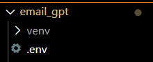
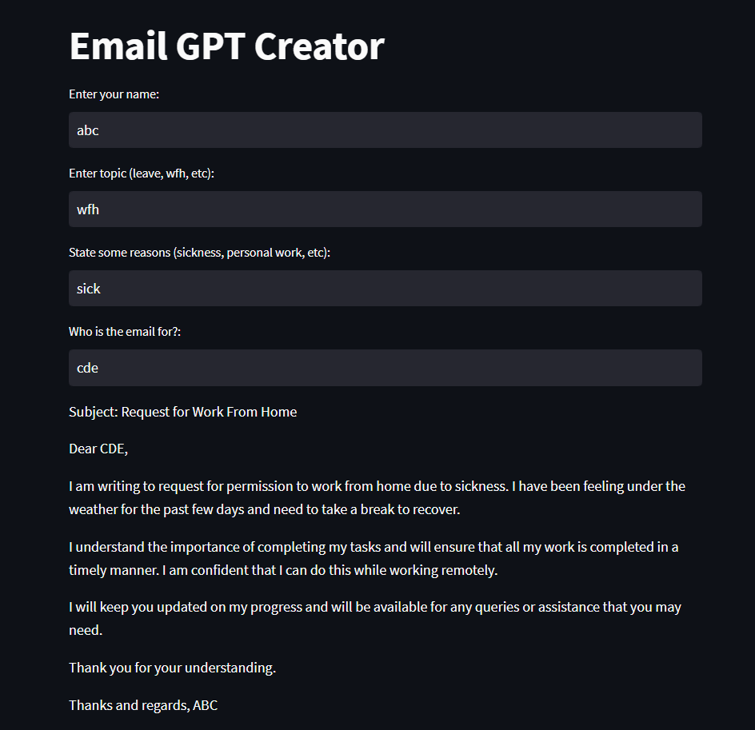

### Simple app that uses llm to generate email

### Installation

To run the app, make sure to include the defined dependencies.
```bash
pip install -r requirements.txt
```

Make sure to create a .env file in your project directory<br>

<br>Inside the file, provide your api key.
```bash
OPENAI_API_KEY = your_key
```
### Start the Server
```bash
python run app.py
```

